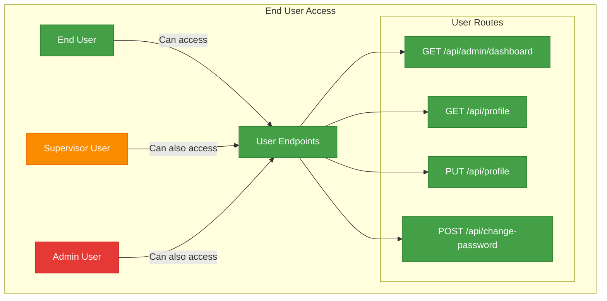

# Technical Documentation: TypeScript Authentication System

This document provides a comprehensive technical overview of the TypeScript Authentication System, including database structure, API architecture, authentication workflows, and testing methodologies.

## Table of Contents

1. [System Architecture](#system-architecture)
2. [Database Structure](#database-structure)
3. [API Structure](#api-structure)
4. [Authentication Workflows](#authentication-workflows)
5. [API Usage Steps](#api-usage-steps)
6. [Role-Based Access Control](#role-based-access-control)
7. [Testing Scope](#testing-scope)
8. [Security Considerations](#security-considerations)

## System Architecture

The authentication system follows a modern Node.js/Express architecture with TypeScript for type safety and MongoDB for data persistence.


## Database Structure

The system uses MongoDB with three primary collections: Users, Tokens, and Verifications. Below is a diagram showing the database schema and relationships:


### Collection Details

#### User Collection
- Stores user credentials and profile information
- Password is hashed using bcrypt before storage
- Includes role information for access control (admin, supervisor, enduser)
- Tracks verified status for email verification

#### Token Collection
- Stores refresh tokens for maintaining user sessions
- Includes expiration dates for security
- TTL index automatically removes expired tokens
- References user by userId

#### Verification Collection
- Supports multiple verification types (email, password reset)
- Stores verification tokens with expiration dates
- TTL index automatically removes expired verifications
- References user by userId

## API Structure

The API is organized into route modules, middleware, and services:


### API Endpoints

| Endpoint                       | Method | Description                           | Access Level      |
|--------------------------------|--------|---------------------------------------|-------------------|
| `/api/auth/signup`             | POST   | Register a new user                   | Public            |
| `/api/auth/verify-email`       | POST   | Verify email with token               | Public            |
| `/api/auth/resend-verification`| POST   | Resend verification code              | Public            |
| `/api/auth/login`              | POST   | Login with credentials                | Public            |
| `/api/auth/refresh`            | POST   | Refresh access token                  | Public            |
| `/api/auth/logout`             | POST   | Logout (invalidate token)             | Public            |
| `/api/auth/logout-all`         | POST   | Logout from all devices               | Authenticated     |
| `/api/auth/forgot-password`    | POST   | Request password reset                | Public            |
| `/api/auth/reset-password`     | POST   | Reset password with token             | Public            |
| `/api/profile`                 | GET    | Get user profile                      | Authenticated     |
| `/api/profile`                 | PUT    | Update user profile                   | Authenticated     |
| `/api/change-password`         | POST   | Change password                       | Authenticated     |
| `/api/admin/users`             | GET    | Get all users                         | Admin             |
| `/api/admin/users/:id/role`    | PUT    | Update user role                      | Admin             |
| `/api/admin/reports`           | GET    | Access reports                        | Admin/Supervisor  |
| `/api/admin/dashboard`         | GET    | Access dashboard                      | Any Authenticated |

## Authentication Workflows

The system implements several authentication workflows:

### Registration and Email Verification


### Login and Token Refresh


### Password Reset Flow


## API Usage Steps

Here's a step-by-step guide for implementing authentication in a client application:

### User Registration Flow


### Authentication Flow


## Role-Based Access Control

The authentication system implements a comprehensive role-based access control (RBAC) model with three distinct user roles arranged in a hierarchical permission structure. This allows for fine-grained control over who can access which parts of the application.

### Role Hierarchy

The system enforces a strict role hierarchy where higher-level roles inherit all permissions from lower-level roles:


### Role Definitions

1. **Admin Role (`UserRole.ADMIN`)**: 
   - System administrators with full access to all functionality
   - Can manage users, assign roles, and access all protected routes
   - Typically assigned to technical staff or organization leadership
   - Has access to user management and system configuration

2. **Supervisor Role (`UserRole.SUPERVISOR`)**: 
   - Mid-level access for team managers or supervisors
   - Can access reporting and monitoring features
   - Cannot modify user roles or access system configuration
   - Has all the permissions of regular end users plus additional oversight capabilities

3. **End User Role (`UserRole.ENDUSER`)**: 
   - Base level access for regular application users
   - Can manage their own profile and use basic application features
   - Cannot access administrative or supervisory functions
   - Default role assigned to all new users

### Route Access Patterns

The route access patterns demonstrate which roles can access which API endpoints:




### RBAC Implementation

The role-based access control is implemented through middleware functions in the `auth.middleware.ts` file:

1. **Authentication Middleware** (`authenticate`): 
   - Verifies JWT tokens for all protected routes
   - Attaches user information including role to the request object
   - Required for all protected endpoints

2. **Admin Check Middleware** (`requireAdmin`):
   - Ensures the authenticated user has the Admin role
   - Returns 403 Forbidden if a non-admin attempts to access an admin-only route

3. **Supervisor Check Middleware** (`requireSupervisor`):
   - Ensures the authenticated user has either Admin or Supervisor role
   - Returns 403 Forbidden if a regular user attempts to access a supervisor route

This middleware-based approach allows for clean route definitions with appropriate access restrictions:

```typescript
// Admin-only route example
router.get('/users', authenticate, requireAdmin, userController.getAllUsers);

// Supervisor route example
router.get('/reports', authenticate, requireSupervisor, reportController.getReports);

// Regular user route example
router.get('/profile', authenticate, userController.getProfile);
```

By enforcing role-based access at the route level through middleware, the system ensures that unauthorized users cannot access restricted functionality, even if they possess a valid authentication token.

## Testing Scope

The system implements comprehensive testing for authentication workflows:


### Testing Automation

The system provides both automated and interactive testing approaches:


## Security Considerations

The system implements several security measures:

1. **Password Security**: 
   - Passwords are hashed using bcrypt before storage
   - Password complexity requirements enforced

2. **Token Management**:
   - Short-lived access tokens (15 minutes by default)
   - Refresh tokens with secure rotation
   - Token storage in HTTP-only cookies as an option

3. **API Security**:
   - Rate limiting on authentication endpoints
   - CORS configuration
   - Helmet for HTTP header security

4. **Data Protection**:
   - Input validation
   - Prevention of user enumeration
   - Automatic cleanup of expired tokens and verification records


---

This technical documentation provides a comprehensive overview of the TypeScript Authentication System architecture, workflows, and testing methodology. For specific implementation details, refer to the source code and comments within individual files.